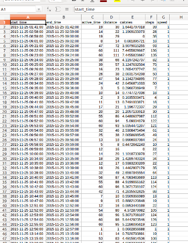
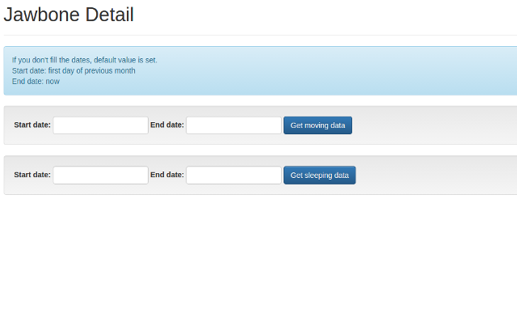

# Jawbone-Detail

	    
	    <h2>Why you need this app?</h2>
	    

		Although the official jawbone app, "UP by Jawbone" is very useful, you may want to see more detailed data your jawbone collected. 
		"Jawbone Detail" enebles you to extract the most detailed data using jawbone web api. 
		As shown below, this app count your activity data by minites. 
		This app suits for these people.
	    

	    <dl>
		<dt>Scientist</dt>
		<dd>- A person who want to use jawbone for academic research.</dd>
		<dt>Health enthusiast</dt>
		<dd>- A person who is very dedicated athelete.</dd>
	    </dl>
	    
Good luck!

